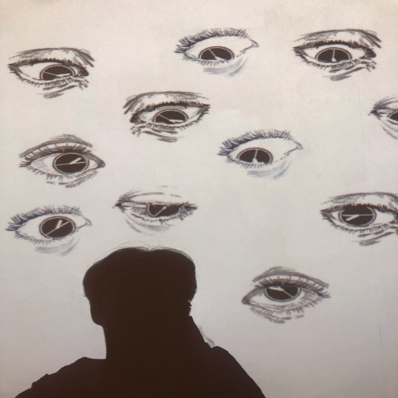

[{: width="30%" height="30%"}](https://hxngiee.github.io/2021-04-21-sketch2art/) {: width="30%" height="30%"} {: width="30%" height="30%"}
 
{: width="30%" height="30%"} {: width="30%" height="30%"} {: width="30%" height="30%"}

<!-- 주석
{: width="30%" height="30%"} {: width="30%" height="30%"} {: width="30%" height="30%"}
-->
